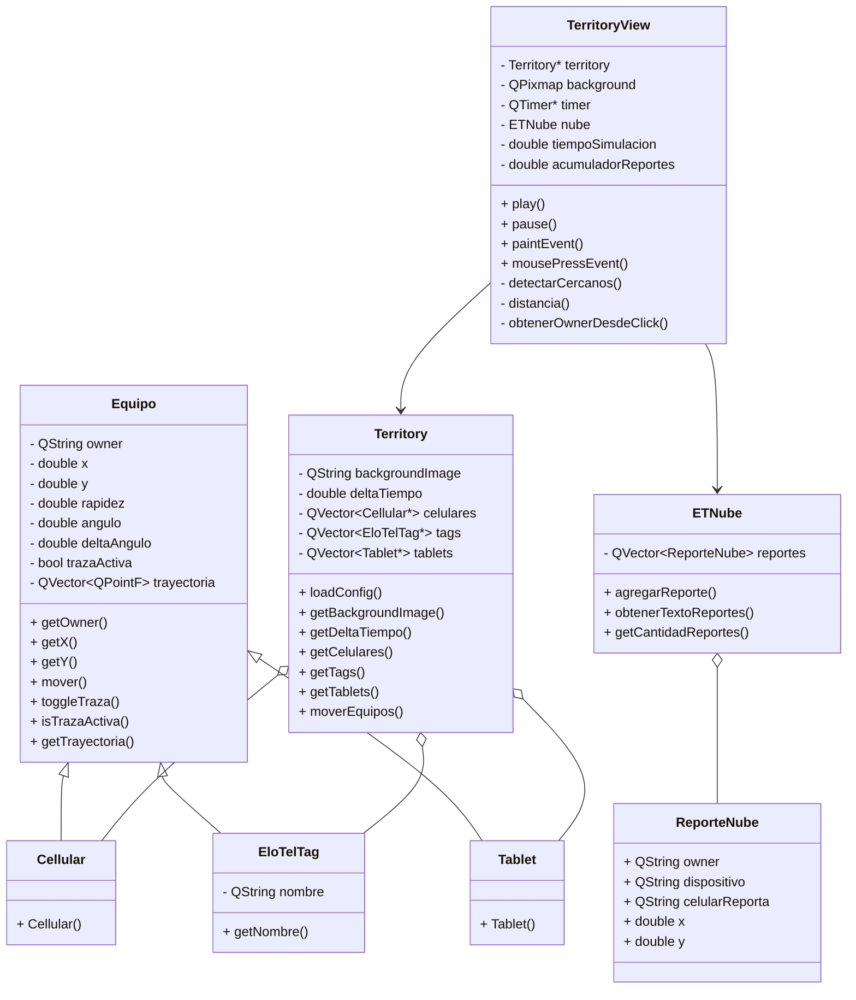

# Diagrama UML - Tarea 3 EloTelTags

Este diagrama representa la estructura principal de clases utilizadas en la versión final del proyecto, correspondiente a `stage4`.

## Explicación breve

La clase `Equipo` es la clase base del sistema. Desde ella heredan `Cellular`, `EloTelTag` y `Tablet`, ya que todos los dispositivos comparten posición, rapidez, ángulo, movimiento y trayectoria.

La clase `Territory` se encarga de leer el archivo de configuración y almacenar las listas de celulares, tags y tablets.

La clase `TerritoryView` se encarga de mostrar gráficamente el mapa, los equipos, el radar, las trazas y el menú Find My.

La clase `ETNube` simula la nube donde se guardan los reportes generados cuando un tag o una tablet detecta un celular cercano.
